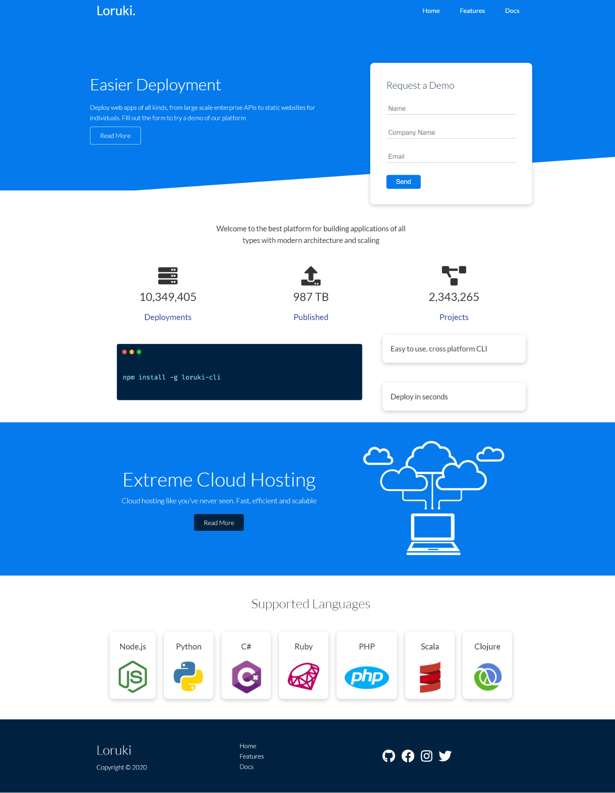
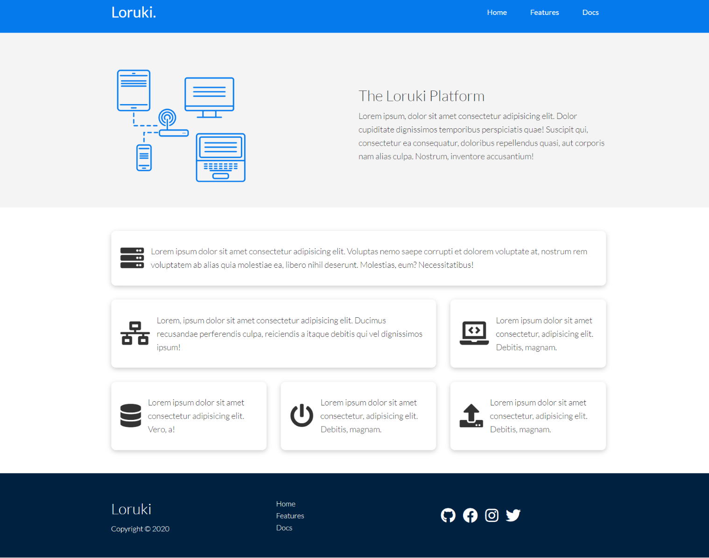
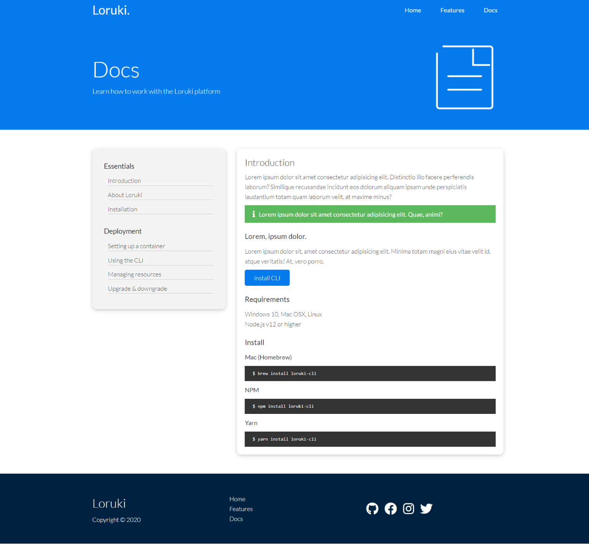

# Loruki - A simple responsive website made with HTML & css(SCSS).

## This is a simple website from a youtube video by **Brad Traversy**

---

This is a link to the video :

[Loruki](https://www.youtube.com/watch?v=p0bGHP-PXD4)
[Live Preview](https://mohammedghazaly.github.io/Loruki---A-Simple-Multipage-Responsive-Website/index.html)

I coded it myself and added some changes.

---

## screenshots

### Home Page

### Features Page

### Docs Page

